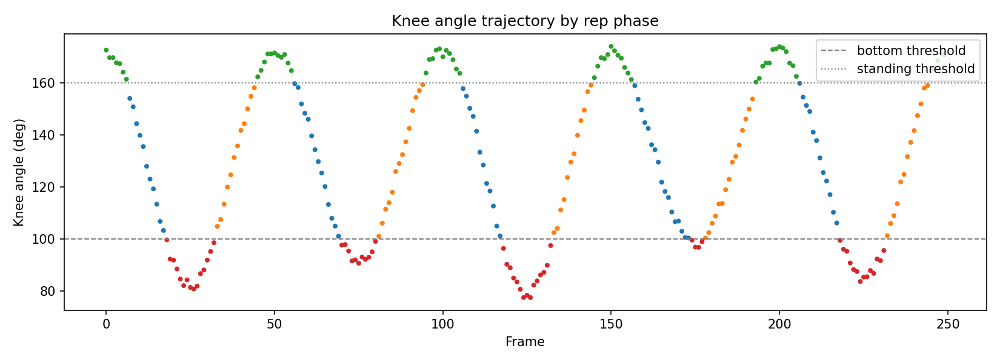
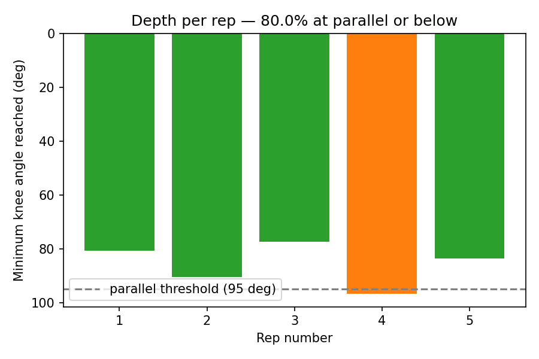

# Example Session Summary

Generated from `data/sample_session/pose_session_example.json` (synthetic
demo data — see notebook for details) via `notebooks/analysis.ipynb`.

| Metric | Value |
|---|---|
| Total reps | 5 |
| Reps at parallel or below (≤95°) | 4 |
| Success rate | 80.0% |
| Best depth | 77.4° |
| Average depth | 85.8° |

