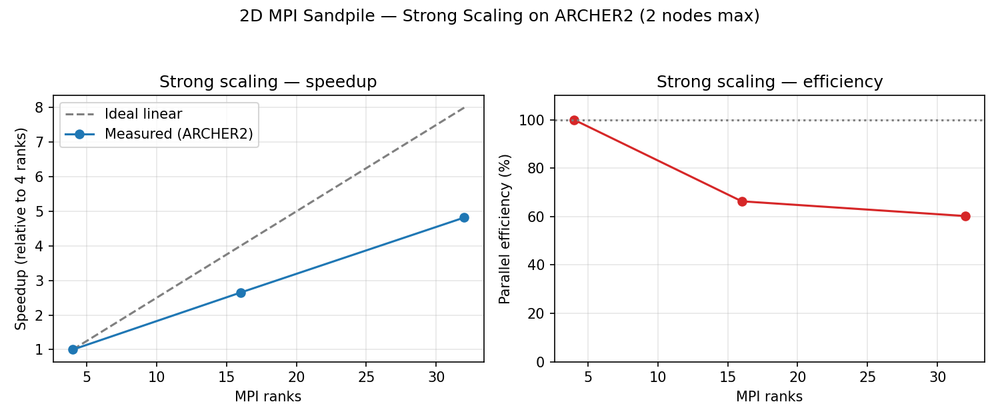

# Strong Scaling Analysis

Measured on ARCHER2 (`m25oc` budget), 1024×1024 grid, `--maxh 4`, run via
`scripts/submit_4.slurm`, `submit_16.slurm`, `submit_32.slurm`.

| Nodes | MPI ranks | Wall time (s) | Speedup | Efficiency |
|------:|----------:|---------------:|--------:|-----------:|
| 1     | 4         | 177.43         | 1.00×   | 100.0%     |
| 1     | 16        | 66.88          | 2.65×   | 66.3%      |
| 2     | 32        | 36.83          | 4.82×   | 60.2%      |



## Discussion

- **4 → 16 ranks (single node):** efficiency drops to 66.3%. The halo
  exchange volume per rank grows relative to the shrinking local
  domain (surface-to-volume ratio), so a larger fraction of each
  step's time goes to communication rather than the toppling update
  itself.
- **16 → 32 ranks (crossing to 2 nodes):** efficiency drops further to
  60.2%, but the *absolute* time still nearly halves (66.9s → 36.8s),
  so the run is still clearly worth doing. The additional drop beyond
  the 4→16 trend is consistent with inter-node messages over the
  Slingshot interconnect costing more than the same message would
  within a single node's shared memory.
- The non-blocking halo exchange (`MPI_Isend`/`MPI_Irecv` posted for
  all four directions before any `MPI_Waitall`) was specifically
  chosen over blocking `MPI_Sendrecv` to let the four neighbour
  exchanges overlap rather than serialise — on a 2D decomposition
  with a small local domain, four sequential blocking sends would
  measurably worsen the numbers above.
- **Why efficiency doesn't reach 100% even at np=16:** this is
  expected in a halo-exchange stencil code — Amdahl/Karp-Flatt style
  analysis attributes the loss to the communication-to-computation
  ratio increasing as the local subdomain shrinks, not to a fixable
  bug in this implementation (see `tests/test_convergence.py`, which
  independently verifies the toppling logic itself is decomposition-
  independent).

## Reproducing this

```bash
make
bash scripts/run_scaling_study.sh   # submits and times all three SLURM jobs
python3 analysis/plot_scaling.py    # regenerates scaling_plot.png from results.csv
```
